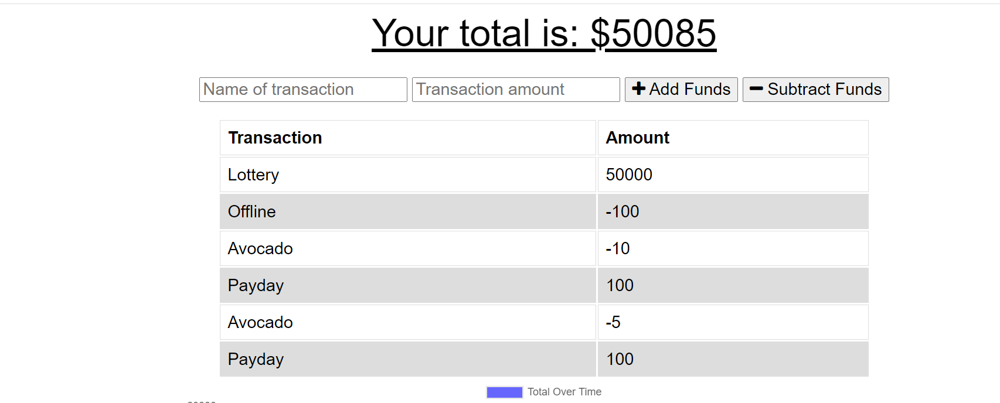
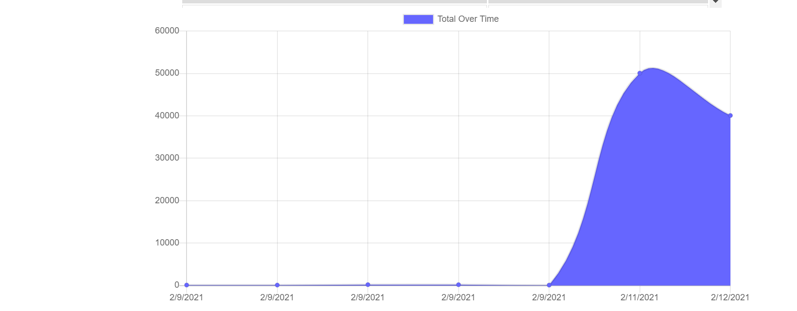

# Tech Girl Budget Tracker 📈

## Description

Budget Tracker is a progressive web application that allows users to track their budgets by adding expenses and deposits to their budget through the "Add/Subtract Funds" buttons. They are able to add a transaction with or without a connection. When a user enters a transaction while offline, these transactions are stored in the indexedDB, and transferred to the database when the user comes back online.
## Installation

To install the required dependencies, run `npm install`

This package assumes there is a MongoDB server running on localhost:27017. If your server is running somewhere else, you can edit `server.js` to reflect that.

## Usage
### Screenshots

An example screenshot of the application:

Please check out the launched app on Heroku [here](https://mysterious-sands-34008.herokuapp.com/)!

## Credits

* Tutor 

* Classmates
### Built With

 

    
    
    
    
    
    

## License

 

    

Copyright (c) [2020] [Selena Singleton]

